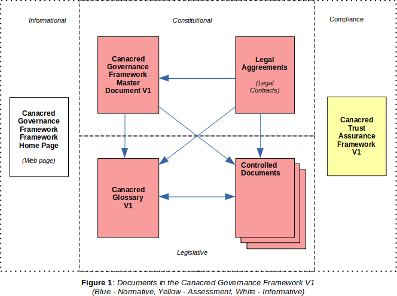

## Preface
This is an official document of the ​Canadian Credential Network Utility Governance Framework​ ("CCNU-GF"). If you have comments or suggestions, we invite you to submit them using our [issue tracker](https://github.com/Canacred/CCNU-gf/issues). If you are interested in joining the Canadian Credential Network, please feel free to [contact us](https://canacred.github.io/ccnu-gf/contact_us/).

## Version Control

* **Version**: 0.2
* **Governing Board Approval Date**: TBD
* **Comments**: Ratification of the CCNU-GF will take place upon the formation of the Governing Board (at first meeting).
* **Status**: CCNU Governance Framework Working Group is currently developing the CCNU-GF.

## Acknowledgements
​This document was produced on behalf of the CCNU Governing Board by the CCNU Governance Framework Working Group.

## Introduction
The purpose of the Canadian Credential Network Utility is to provide a decentralized global public utility for trusted relationship in Canada.
The Canadian Credential Network Utility (the "CCNU-GF") serves as the *constitution* for the *Canadian Credential Network Utility*. It represents an instance of a [ToIP Layer One Public Utility Governance Framework](https://trustoverip.org/working-groups/governance-stack/) under the guidance of the [ToIP Utility Foundry Working Group](https://trustoverip.org/working-groups/utility-foundry/).


The CCNU-GF leverages the principles, policies, terminology, and standards necessary to enable trusted digital relationship based on decentralized identity.

A key objective of the CCNU-GF is to address any concerns or risks that Network members may have as Utility participants. For example, compliance with Data Protection Regulations such as the Canada's Privacy Act and the Canadian Personal Information Protection and Electronic Documents Act (PIPEDA).

The purpose of the Canadian Credential Network is to administer decentralized governance for Canadian Credential Network Utility.

## Governance Framework

### Governance Documents
The CCNU-GF formally consists of a set of interrelated documents that collectively form the governance model for the Utility that the Network manages. The documents are organized in three (3) categories; Blue = Normative, Yellow = Assessment, White = Informative.



| Category | Name | Description |
| --- | --- | --- |
| Primary (White) | Canacred GF Whitepaper | Introduction to the Canacred Governance Framework Version 1|
| Primary (Blue) | Canacred Governance Framework (CCNU-GF) Master Document | The “constitution” of the Network, this document defines the purpose, core principles, and core policies, and also references all other documents in the GF. |
| Primary (Blue)| Canacred Glossary | A comprehensive glossary of terms used throughout all the CCNU-GF documents |
| Primary (Yellow)| Canacred Trust Assurance Framework | This document defines criteria and processes for assessing conformance of network stakeholders to the policies of the CCNU-GF.|
| Legal (Blue)| Canadian Credential Network Utility Participation Agreement | Contractual instrument between the Network and a member. |
| Legal (Blue)| Canacred Steward Agreement | Contractual instrument between the Network and a Governing or Operational Member. |
| Legal (Blue)| Canacred Steward Data Processing Agreement | Contractual instrument between the Network and a Governing or Operational Member. |
| Legal (Blue)| Canacred Transaction Endorser Agreement | Contractual instrument between the Network and a Governing, Operational or Subscriber Member. |
| Legal (Blue)| Canacred Transaction Endorser Data Processing Agreement | Contractual instrument between the Network and a Governing, Operational or Subscriber Member.  |
| Legal (Blue)| Transaction Author Agreement |Contractual instrument between the Network and any person or organization initiating a write transaction to the Utility.|
| Controlled Documents (Blue)| Governing Body Policies | The governance policies that apply to all CCNU Governing Bodies.|
| Controlled Documents (Blue)| Ledger Access Policies | Governing policies for reading and writing to the Utility and the processing of CCNU transactional data. |
| Controlled Documents (Blue)| Member Business Policies |Governing qualification, application, activation, operation, suspension, and termination of members.|
| Controlled Documents (Blue)| Member Technical Policies |Governing the security, node operation, node selection, and reporting requirements for members.|
|Controlled Documents (Blue)| Economic Policies | Governing economic incentives, fees, and regulatory compliance and budgetary management.|
|Controlled Documents (Blue)| Canacred Certification Mark Policies |Governing the establishment of and use of the Canacred Certification policies for ecosystem stakeholders. |

### Core Principles
See [CCNU Principles](./principles.md).

## Core Polices
In keeping with all Core Principles and especially the Decentralization by Design and Security by Design principles:

1. Policies, practices, procedures, and algorithms governing participation of [Stewards](./glossary.md) and operation of Nodes MUST follow all Core Principles.
2. The Network MUST publish the following Controlled Documents managed as specified by CCNU Governing Bodies:​
a. Member Business Policies
b. Member Technical Policies​
c. Ledger Access Policies
​
### Inclusion
In keeping with the Inclusive by Design principles but in recognition of the permissioned write structure of the Canadian Credential Network Utility:

1. Read access to the Canadian Credential Network Utility MUST be open to all types of entities.  
2. Write access will be limited to members and non-members in good standing within the Network.
3. Write access will be limited to members and non-members that have signed the necessary ```Utility Agreements```. See ```Exibit B``` of the Participation Agreement.

### Trust Assurance
In keeping with all Core Principles and especially the Decentralization by Design principles:

1. The Network MUST specify policies, practices, and procedures for assessing conformance to the Canacred Governance Framework by publishing and maintaining the Canacred Trust Assurance Framework​ ​as a Controlled Document managed as specified by CCNU Governing Bodies​. The Controlled Documents may leverage resources and guidance from the ToIP Foundation.
2. The Canadian Credential Network MUST publish a Canacred Trust Mark Policies​ ​as a Controlled Document managed as specified by CCNU Governing Bodies.​

## Economics
*I don't know if we need these currently*

In keeping with the Sustainability principle:

1. The Network  MAY publish the Canacred Economic Policies​ ​as a Controlled Document managed as specified by CCNU Governing Bodies​ in conjunction with Network legal counsel.
2. The Network MAY manage Ledger Fees and any mechanism used for paying them to ensure economic viability and sustainability for the Network to keep with its charter as a non-profit public trust organization.
3. The Network SHOULD retain a qualified Auditor to publish an annual public audit of Network finances.

## Governance
The Canacred Governance Framework Master Document and the Controlled Documents listed in ```Appendix A``` shall be revised from time to time. The policies in this section govern this process and procedures for managing document lifecycles.

### General
1. The Network MUST publish CCNU Governance Bodies as a Controlled Document managed by the Board of Directors.
2. CCNU Governance Bodies MUST specify the Canadian Credential Network Governing Body for each Controlled Document.
3. All CCNU-GF documents, including Controlled Documents, MUST use keywords in policies as defined in [IETF RFC 2119](https://tools.ietf.org/html/rfc2119).
4. All CCNU-GF documents MAY be revised to add non-normative
content, such as references to appendices, white papers, or other explanatory materials, without triggering a formal revision review process as defined in this ```Governance Section```.

### Source Control
All CCNU-GF documents will reside in a [Github source control repository](https://github.com/bedrock-consortium/bbu-gf) and will use the associated [Issue Tracker](https://github.com/bedrock-consortium/bbu-gf/issues/) for change management.

### Approved Framework Process
1. Stable versions of the CCNU-GF must be approved by the Board of Directors.
2. Approved versions need to be specified in the ```Version Control``` section of this document.
3. A static PDF file associated with the approved version MUST be stored in the ```/pdf/approved``` folder of the GitHub repo.
4. ```Appendix A``` of this document must be updated to point to the newly approved PDF file.

### Master Document Revisions
These policies apply to any normative revision to the present document, exclusive of ```Appendix A```.
1. Revisions to the CCNU-GF Master Document MUST respect the Purpose and Core Principles.
2. The commencement of any revision process MUST be publicly announced by the Network no later than the time of commencement.
3. Decisions in the revision process is restricted to the Governing Board and SHOULD consider input from all CCNU members.
4. Proposed revisions MUST be publicly announced by the Network.
5. Revisions MUST be approved by a supermajority vote of at least two-thirds of the Governing Board and before the revision takes effect.

### Controlled Document Revisions
These policies apply to any normative revision to the Controlled Documents listed in ```Appendix A```.
1. The list of Controlled Documents in Appendix A, as well as each Controlled Document on that list, MAY be revised independently from the CCNU-GF Master Document (the present document).
2. A Controlled Document MUST be stored in and use the source control mechanisms established in this ```Governance Section```.
4. Revisions to a Controlled Document MUST be approved by the Governing Board before the revision takes effect.

## Appendix A: Controlled Documents
The following Controlled Documents are normative components of the CCNU-GF. All framework content is published by the Network in three forms:

1. A static PDF document representing the entire governance framework in a single document.
    * [Latest compilation of material from the GitHub Repo](../../pdf/bedrock-business-utility-gf.pdf)
    * [Official Governing Board Approved Version](../../pdf/approved/bedrock-business-utility-gf-v1.pdf)
2. A sub-section of the [CCNU website](https://bedrock-consortium.github.io/bbu-gf/) so that all documentation is easily navigated.  
3. Independent markdown files (```.md```) in the [GitHub Repo](https://github.com/bedrock-consortium/bbu-gf).

### Definitions

| Document Name | Description | Governed By |
| --- | --- | --- |
| CCNU Glossary | Definitions of all terms used in the CGF | Governance Framework Working Group |
| Governing Bodies | Definitions of governing bodies within the Network | Canacred Governing Board |
| Ledger Transaction Data|  Defines the data and metadata process by a Steward Node | Technical Steering Committee |

### Specifications

| Document Name | Description | Governed By |
| --- | --- | --- |
| Decentralized Identifiers | [Specification for DIDs and DID documents](https://w3c-ccg.github.io/did-spec/) | W3C Credentials Community Group |  |
| CCNU DID Method 1.0 Specification | Specification for the CCNU DID Root Namespace. See [Issue 13](https://github.com/bedrock-consortium/bbu-gf/issues/13) |  Technical Steering Committee |
| Verifiable Credentials Data Model 1.0 | [Specification for verifiable credentials](https://w3c.github.io/vc-data-model/) | W3C Verifiable Claims Working Group |

### Policies

| Document Name | Description | Governed By |
| --- | --- | --- |
| Governing Body Policies | Chartering and functioning of CCNU Governing Bodies | Governing Board |
| Ledger Access Policies | Read and write access to the Canadian Credential Network Utility | Governance Framework Working Group |
|  Member Business Policies | Member qualification, enrollment, and operational status | Membership Committee |
| Membership Technical Policies | Technical requirements for operating and protecting components of the CCNU infrastructure. | Technical Steering Committee|
| Economic Policies | Budgetary policies for the CCNU. | Finance Committee |
| Trust Mark Policies |Acceptable uses of the Bedrock Trust Mark| Governance Framework Working Group |

### Frameworks
| Document Name | Description | Governed By |
| --- | --- | --- |
| Trust Assurance Framework | Trust assurance for CGF actors |  Governance Framework Working Group |
